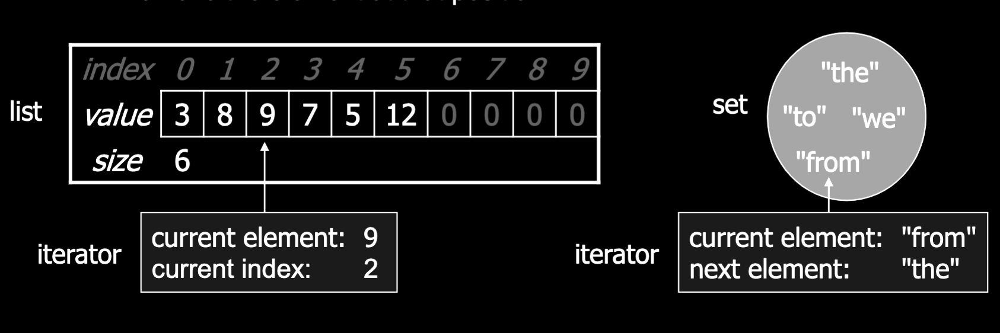

# Iterators

- Iterator: An object that allow a client to retrieve the elements of any collection without knowing the underlying implementation of the collection.
  - Remembers a position and lets you:
    - get the element at position
    - advance to the next position
    - remove the element at the current position

